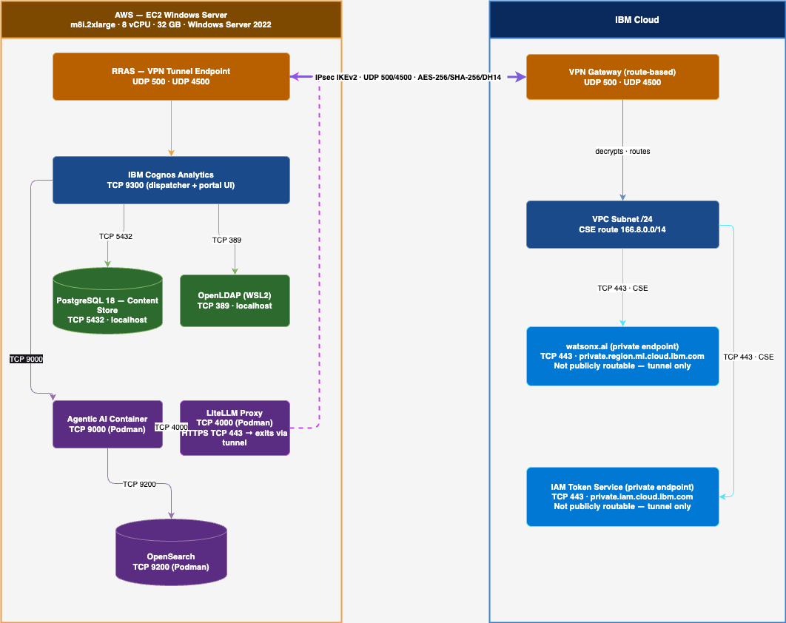

# Overview

This demo shows that IBM Cognos Analytics — running on an AWS EC2 Windows Server with no general internet access — can reach IBM watsonx.ai exclusively over a private site-to-site IPsec tunnel into IBM Cloud, with the AI backend never publicly exposed at any point. The tunnel is the only egress path: the VM's security group is locked to the two IBM Cloud VPN gateway IPs on UDP 500/4500.


# Demo Architecture



# Environment Setup

Set up a folder "environment" based on the files in "environment.template"

# Creation of "On-Premise" VM
Create the EC2 instance that simulates the "on-premise" VM using:

```
cd environment/
source windows-vm-aws-creation-env.sh
cd ./scripts 
sh windows-vm-aws.sh 
```
# Configuration of IBM Cloud VPN
Configure IBM Cloud private endpoint & VPN

```
cd environment/
source s2s-cloud-env.sh 
```

Then follow the instructions in [docs/Setup S2S VPN-cloud.md](https://github.com/nicolenair/wxai-site2site-vpn-with-cognos/blob/main/docs/Setup%20S2S%20VPN-cloud.md)

# Configuration of IBM Cloud VPN

Update VM security group
```
cd environment
source windows-vm-aws-sg-update-env.sh
cd ../scripts
sh windows-vm-aws-sg.sh
```

# Configure VPN on Windows VM side

Follow instructions in [docs/Setup S2S VPN-vm.md](https://github.com/nicolenair/wxai-site2site-vpn-with-cognos/blob/main/docs/Setup%20S2S%20VPN-vm.md)


# Cognos installation

```
cd environment
source cognos-vm-env.sh
```

Then follow instructions in [docs/Cognos Setup.md](https://github.com/nicolenair/wxai-site2site-vpn-with-cognos/blob/main/docs/Cognos%20Setup.md)